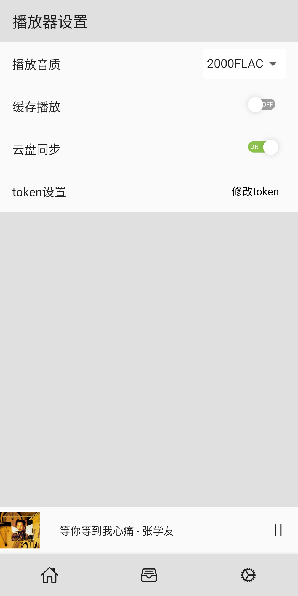
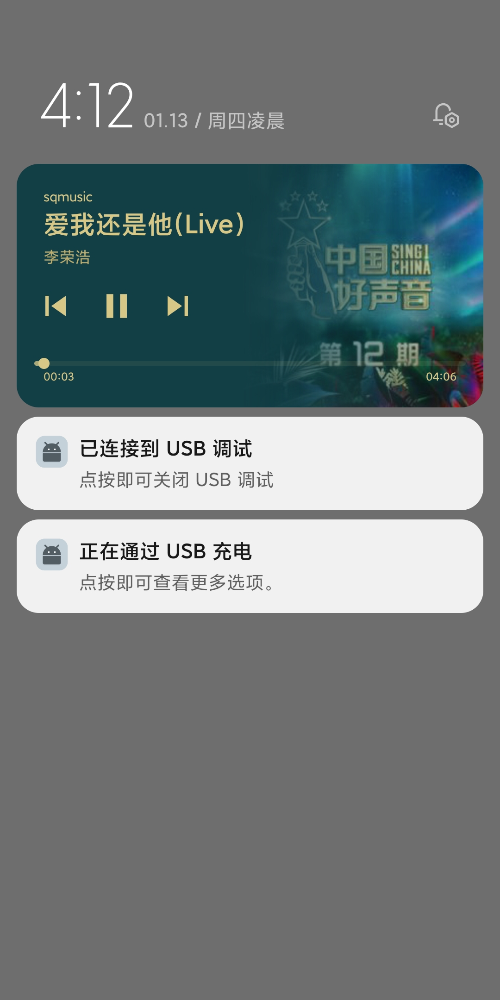

# sqmusic

一个音乐播放器，歌曲可以自动同步到阿里云盘中
编译可以直接运行，无依赖后台服务。
目前仅测试安卓，无mac环境无法测试

ios
1. 需要打开http支持
2. 不喜欢启动白屏的可以自行修改启动闪屏页

## 截图

## 如何打包
 1. clone代码
  git clone hhttps://gitee.com/shang_qi/flutter_sqmusic.git
 2.安装依赖
  进入代码目录执行  flutter pub get   安装依赖
 3.打包
 运行 flutter build apk  进行打包  （使用签名请自行百度）

